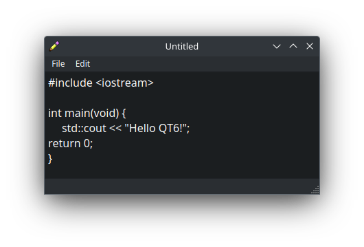
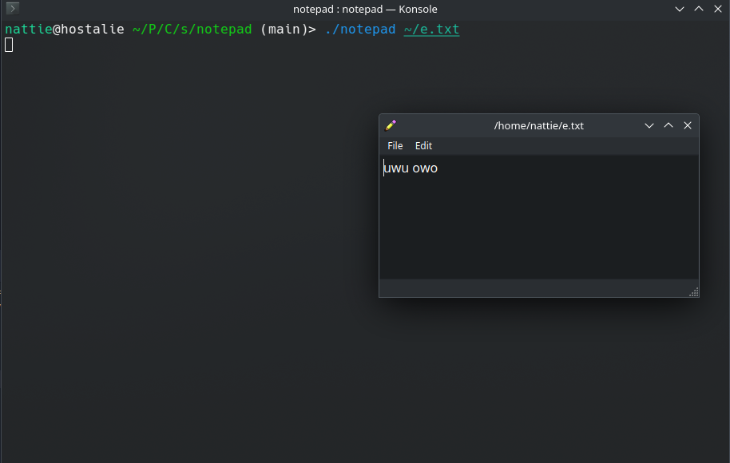

# notepad-qt

My first qt app! Simple notepad application.





## Installation:

Get it from the releases page. (no one should use this lmao)

Extract the folder and done. Or create a notepad.desktop file for your DE.

### Creating the notepad.desktop:
```bash
cd ~/.local/share/applications

vim notepad.desktop
```
then add this (change the paths to fit your pc.)
```bash
#!/usr/bin/env xdg-open
[Desktop Entry]
Encoding=UTF-8
Version=1.0
Type=Application
Terminal=False
Exec=/home/{user}/{path/to/release}/notepad
Name=QT Notepad
Icon=/home/{user}/{path/to/release}/Pencil.png
```